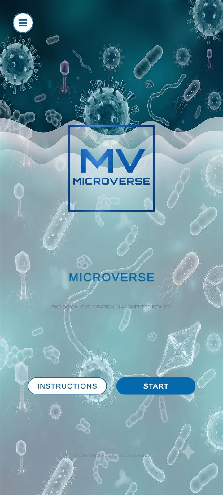
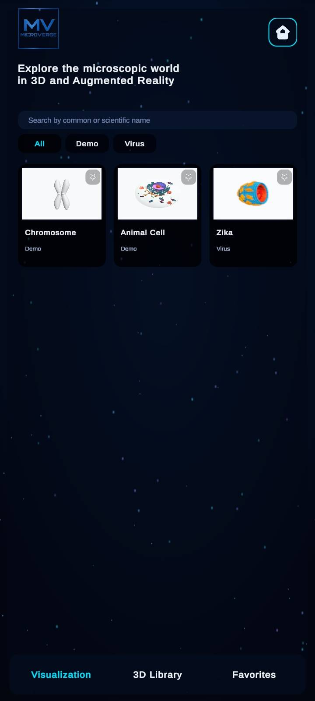
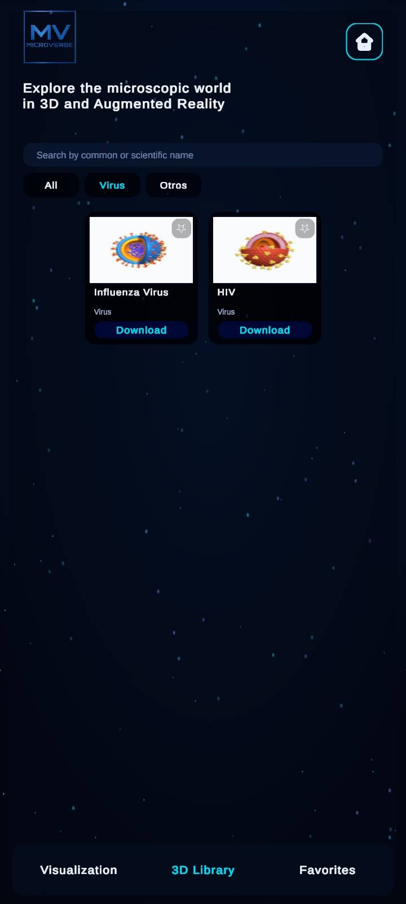
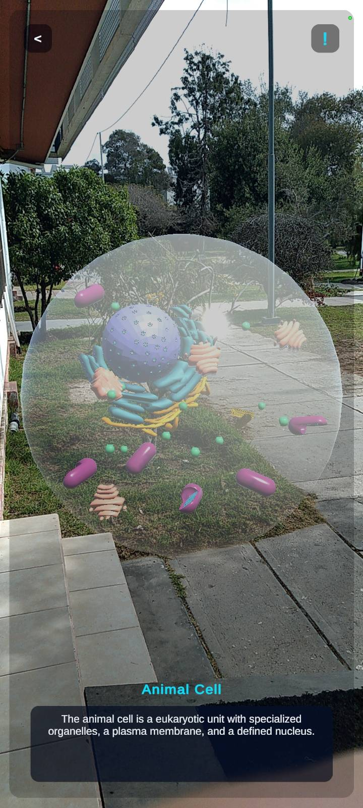

# Microverse

**Microverse** es una aplicacion educativa desarrollada en Unity para explorar modelos biologicos en 3D y Realidad Aumentada. Su objetivo es acercar el mundo microscopico a estudiantes y docentes mediante una experiencia visual, interactiva y preparada para funcionar incluso en escenarios de conectividad limitada.

La aplicacion combina modelos incluidos dentro del build, contenido remoto administrado desde Supabase, descarga offline de modelos, traduccion multilenguaje y un visor AR basado en camara.

## Caracteristicas principales

- Exploracion de modelos biologicos en 3D.
- Modo de Realidad Aumentada con camara del dispositivo.
- Catalogo con busqueda, filtros, favoritos y categorias.
- Biblioteca 3D con descarga de modelos remotos.
- Funcionamiento offline para modelos incluidos y modelos descargados.
- Integracion con Supabase para administrar catalogo y metadatos.
- Traduccion a espanol, ingles y portugues.
- Preparacion para build Android App Bundle (`.aab`) y publicacion en Google Play.

## Vista de la aplicacion

| Inicio | Visualizacion | Biblioteca 3D | Realidad Aumentada |
| --- | --- | --- | --- |
|  |  |  |  |

## Tecnologias utilizadas

- **Unity 6000.4.9f1**
- **C#**
- **uGUI / TextMeshPro**
- **Supabase REST API**
- **Google ML Kit Translate**
- **glTFast** para carga runtime de modelos `.glb` y `.gltf`
- **Android App Bundle** para distribucion en Google Play

## Arquitectura general

El proyecto esta organizado por capas para separar datos, servicios, runtime, editor y UI.

```text
Assets/
  Microverse/
    Resources/
      AppLogo/
      Instructions/
      ModelPreviews/
      Models/
    Scripts/
      Data/
      Editor/
      Runtime/
      Services/
      UI/
  Plugins/
    Android/
  Scenes/
docs/
supabase_schema.sql
```

### Capas principales

- `Runtime`: arranque automatico de la app y dispatcher del hilo principal.
- `Data`: modelos de datos como `BiologicalModel`, `LocalizedText` e idiomas.
- `Services`: catalogo local/remoto, descargas, favoritos, previews y traduccion.
- `UI`: pantallas, tarjetas, navegacion, visor AR y componentes visuales.
- `Editor`: herramientas para sincronizar configuracion y preparar builds Android.

## Flujo de datos del catalogo

Microverse usa un servicio compuesto para construir el catalogo final:

1. Carga modelos incluidos en la app desde `LocalModelCatalogService`.
2. Agrega modelos descargados previamente desde `ModelDownloadStore`.
3. Intenta obtener modelos y categorias desde Supabase.
4. Fusiona los resultados sin perder el contenido incluido.
5. Mantiene metadatos y previews para uso offline.

Esto permite que la app siga mostrando contenido aun cuando no hay conexion disponible.

## Backend con Supabase

El esquema base esta en:

```text
supabase_schema.sql
```

Tablas principales:

- `categorias`: grupos o clasificaciones de modelos.
- `modelos_3d`: informacion de cada modelo, URL del archivo, preview, descripcion y metadatos visuales.

La app lee la configuracion desde:

```text
.env
Assets/Resources/supabase_config.json
```

> Importante: solo debe usarse una llave publica anon/publishable de Supabase. Nunca incluir `service_role`, claves privadas o secretos administrativos dentro de una app movil.

## Modelos incluidos y modo offline

Los modelos base se empaquetan dentro de:

```text
Assets/Microverse/Resources/Models
Assets/Microverse/Resources/ModelPreviews
```

Los modelos descargados se guardan en `Application.persistentDataPath`, junto con sus metadatos y previews. Gracias a esto, un modelo descargado puede seguir disponible despues de cerrar y abrir la app sin internet.

## Realidad Aumentada

El modo AR utiliza la camara del dispositivo mediante `WebCamTexture`. El sistema:

- solicita permisos de camara;
- prueba configuraciones compatibles del dispositivo;
- ajusta rotacion, espejo y escala de la imagen;
- muestra el modelo 3D sobre el fondo de camara;
- permite rotar y escalar el modelo con gestos;
- incluye una advertencia de seguridad para uso responsable de AR.

Si la camara no se puede iniciar, la app muestra un modo de simulacion visual para evitar que la experiencia quede bloqueada.

## Traduccion

La aplicacion maneja textos en:

- Ingles
- Espanol
- Portugues

En Android, la traduccion automatica se realiza con Google ML Kit a traves de un puente nativo ubicado en:

```text
Assets/Plugins/Android/com/microverse/translation
```

En editor o plataformas no soportadas, la app usa un servicio fallback que conserva los textos originales.

## Configuracion local

1. Abrir el proyecto con Unity `6000.4.9f1`.
2. Crear un archivo `.env` en la raiz del proyecto:

```env
SUPABASE_URL=https://tu-proyecto.supabase.co
SUPABASE_KEY=tu-anon-key-publica
```

3. En Unity, sincronizar la configuracion:

```text
Microverse -> Sync .env to Config
```

4. Ejecutar la escena:

```text
Assets/Scenes/SampleScene.unity
```

## Build Android

El proyecto incluye herramientas de editor para preparar la build:

```text
Microverse -> Android -> Configure Play Store Settings
Microverse -> Android -> Bump Version Code
```

Configuracion esperada:

- Package name: `com.microverse.app`
- Version name base: `1.0.0`
- Min SDK: API 26
- Target SDK: API 35
- Arquitecturas: ARMv7 y ARM64
- Salida recomendada: `.aab`

Documentacion relacionada:

- [Documentacion tecnica](docs/documentacion-tecnica.md)

## Estructura de documentacion

La documentacion tecnica ampliada se encuentra en:

```text
docs/documentacion-tecnica.md
```

Incluye detalles sobre arquitectura, flujo de arranque, servicios, Supabase, modo offline, AR, traduccion, plugin Android y build de Play Store.

## Estado del proyecto

Microverse cuenta con una base funcional para:

- iniciar la aplicacion desde una escena Unity;
- visualizar catalogos locales y remotos;
- descargar modelos;
- mantener favoritos;
- abrir modelos en visor AR/3D;
- traducir contenido;
- preparar builds Android para distribucion.

## Creditos

Proyecto desarrollado como una experiencia educativa para la exploracion biologica en 3D y Realidad Aumentada.

Instituciones y colaboradores visibles dentro de la app:

- Universidad de La Serena
- LIITEC
- Equipo de desarrollo Microverse
